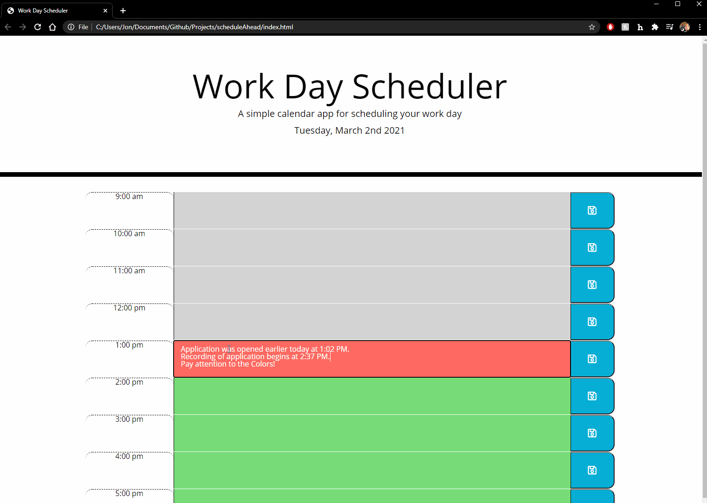

# scheduleAhead

Designed a simply day planner utilizing Jquery & Local storage to dynamically create elements with interactive features. Colors in the planner will change during every change of the hour (@ local time) from 9 AM to 5 PM. User information, typed into any future time blocks can be saved and will persist in local storage. If user types information into a past or current time block, the save button will not function since you cannot make plans for past events. 

## Usage
Creation & Usage of this application was to demonstrate the ability to utilize the "moment" javascript library and the browser's local storage feature. Local Storage allows for the data persistence and the Moment library gives the application current time sensitivity.

## Links
Github: https://github.com/doublem1nt/scheduleAhead
Live Application: https://doublem1nt.github.io/scheduleAhead/

## Demo

## Credits 
Triology Education Services provided prompt, course & instruction. 

## License
[MIT](https://choosealicense.com/licenses/mit/)

## Contributors
Jonathan Yee
Junior Developer
jyeewasabi@gmail.com